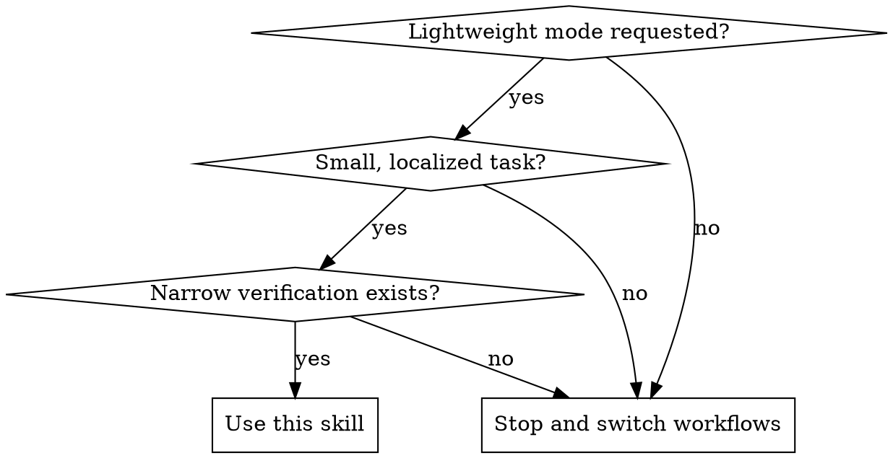

# Keeping Work Lightweight

## Overview

Manual opt-in only. Use this when the user explicitly wants the light-touch path, or when this skill is explicitly invoked. Make the smallest useful change, run the narrowest meaningful verification, and stop.

This skill exists to keep tiny tasks from getting dragged into brainstorming, long planning, worktrees, or default TDD ceremony.

When this skill applies, it overrides those heavier default workflows until an escalation trigger is hit.

**REQUIRED COMPANION SKILL:** Use `verification-before-completion` before any success or completion claim.

## When to Use

- User explicitly says: "quick check", "keep it lightweight", "light touch", "no superpowers", "no brainstorming", "no big plan", "no worktrees", "just verify", or "write tests only if necessary"
- Task is small and localized: docs copy edit, config tweak, patch review, small shell/script fix, one-file bugfix with obvious scope
- A focused verification path exists: one command, one validator, one smoke check, one targeted existing test, or a direct repro/re-run

Do not use when:
- Building a new feature or changing behavior broadly
- Scope is unclear or expanding
- Work spans multiple files or needs design choices
- No credible narrow verification exists
- The user explicitly wants the full superpowers workflow

## Decision Gate

## Core Rules

1. Honor the lightweight request first.
2. Do the minimum useful investigation: inspect the relevant file, diff, command, or reproducer. Do not create ceremony.
3. Do **not** invoke `brainstorming`, `writing-plans`, `using-git-worktrees`, or `test-driven-development` for a clearly small, localized task under this skill unless an escalation trigger below is hit.
4. Prefer one focused change over broad cleanup.
5. Run the narrowest existing verification that can actually prove the result.
6. If the task stops being small and localized, stop and ask whether to switch to the normal workflow.

## Tests Only If Necessary

Write, update, or expand tests only when at least one of these is true:

- The user explicitly asks for tests
- A targeted existing test already covers the area and is the narrowest proof
- The change affects behavior and there is no credible non-test verification
- A small regression test is the safest way to prove the fix

Otherwise, do **not** create new tests, scaffolding, or harnesses just to satisfy process.

If you have an easy real-world reproducer and can rerun the same command to prove the fix, that is enough. Do **not** add a new test just because the task is a bugfix.

## Quick Reference

| Situation | What to do |
|-----------|------------|
| Docs or copy edit | Edit the file and run the docs build, formatter, or link check already used by the project |
| Small script bug | Reproduce with the smallest real command, patch it, rerun the same command |
| Config tweak | Run the narrowest validator, parser, or smoke check that consumes the config |
| Patch or diff review | Inspect the change and run the smallest relevant existing check; do not add tests |
| Existing focused test available | Run that targeted test instead of inventing new coverage or jumping to the full suite |
| Scope expands | Stop lightweight mode and ask whether to switch to planning, TDD, or a broader workflow |

## Escalate Immediately

Stop using this skill and switch workflows if you find any of these:

- More than one non-trivial file needs coordinated changes
- Requirements are unclear or you need product/design choices
- The task is really a new feature, refactor, migration, or broad behavior change
- You cannot prove correctness with narrow verification
- Safe execution now requires isolation, batching, or a larger plan

## Common Mistakes

### Skipping verification because the task is tiny

- **Problem:** "Lightweight" gets used as an excuse to skip proof.
- **Fix:** Still run the narrowest command or reproducer that proves the result.

### Triggering heavyweight skills by reflex

- **Problem:** A tiny bugfix gets dragged into brainstorming, long plans, worktrees, or default TDD.
- **Fix:** Under this skill, do not invoke them unless an escalation trigger is hit.

### Staying lightweight after the scope changes

- **Problem:** A simple edit turns into a broader change, but you keep pushing forward.
- **Fix:** Stop, say the task is no longer light-touch, and ask whether to switch workflows.

### Writing tests for ritual instead of need

- **Problem:** New tests are added just because code changed.
- **Fix:** Add tests only when they are the narrowest credible proof or the user asked for them.

## Example

User: "Keep it lightweight. Fix this shell script bug, no brainstorming, and run the narrowest useful verification."

Use this skill to:
1. Inspect the script and reproduce the bug with one real command
2. Make the focused fix
3. Rerun the same command or the narrowest existing check
4. Report the actual result

No long plan. No worktree. No default TDD. If the repro and rerun prove the fix, stop there.
